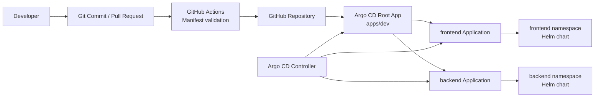

# Argo CD GitOps Platform

[](https://github.com/praveenbhatk8s/argocd-gitops-platform/actions/workflows/validate-manifests.yml)


Production-style GitOps delivery platform built with Argo CD, Helm, and the app-of-apps pattern. The repository demonstrates how platform teams can bootstrap Argo CD, define environment applications declaratively, and let Kubernetes continuously reconcile from Git.

## What This Demonstrates

- Argo CD app-of-apps bootstrap pattern
- Git as the source of truth for application delivery
- Helm-packaged frontend and backend workloads
- Automated sync, pruning, and self-healing
- Namespace-separated application deployments
- CI validation for Kubernetes and GitOps manifests
- Operational docs for architecture, workflows, and troubleshooting

## Architecture



Detailed architecture: [docs/architecture.md](docs/architecture.md)

## Repository Layout

```text
.
├── .github/workflows/          # CI validation
├── apps/dev/                   # Argo CD app-of-apps and child Applications
├── bootstrap/                  # Argo CD install/bootstrap helpers
├── charts/                     # Helm charts for demo workloads
├── docs/                       # Architecture, workflows, troubleshooting
├── manifests/                  # Shared namespaces and base manifests
├── policies/                   # Argo CD operational policies
└── projects/                   # Argo CD AppProject definitions
```

## Prerequisites

- Kubernetes cluster
- `kubectl`
- `helm`
- Argo CD CRDs installed in the cluster
- Network access from Argo CD to this GitHub repository

## Deploy

Install Argo CD if it is not already installed:

```bash
./bootstrap/install-argocd.sh
```

Create application namespaces:

```bash
kubectl apply -f manifests/namespaces.yaml
```

Deploy the root app:

```bash
kubectl apply -f apps/dev/app-of-apps.yaml
```

Watch reconciliation:

```bash
kubectl get applications -n argocd
kubectl get pods,svc -n frontend
kubectl get pods,svc -n backend
```

Expected state:

```text
root-app   Synced   Healthy
frontend   Synced   Healthy
backend    Synced   Healthy
```

## Access Demo Apps

Frontend:

```bash
kubectl port-forward svc/frontend -n frontend 8080:80
```

Open:

```text
http://localhost:8080
```

Backend:

```bash
kubectl port-forward svc/backend -n backend 8081:80
```

Open:

```text
http://localhost:8081
```

## Access Argo CD UI

```bash
kubectl port-forward svc/argocd-server -n argocd 8082:443
```

Open:

```text
https://localhost:8082
```

Get the initial admin password:

```bash
kubectl -n argocd get secret argocd-initial-admin-secret \
  -o jsonpath="{.data.password}" | base64 -d
```

## Platform Decisions

| Decision | Why It Matters |
| --- | --- |
| App-of-apps pattern | Keeps platform bootstrap declarative and repeatable |
| Helm workloads | Matches common enterprise packaging patterns |
| Namespaces per app | Creates a clean boundary for policy and ownership |
| Automated sync | Demonstrates drift correction and continuous reconciliation |
| GitHub Actions validation | Catches obvious manifest issues before Argo CD sees them |

## Troubleshooting

```bash
kubectl describe application root-app -n argocd
kubectl describe application frontend -n argocd
kubectl describe application backend -n argocd
kubectl get events -n frontend --sort-by=.lastTimestamp
kubectl get events -n backend --sort-by=.lastTimestamp
```

More detail: [docs/troubleshooting.md](docs/troubleshooting.md)

## Portfolio Notes

This repo is intentionally compact. It shows how a platform engineer would bootstrap, deploy, observe, and document a GitOps delivery system.
