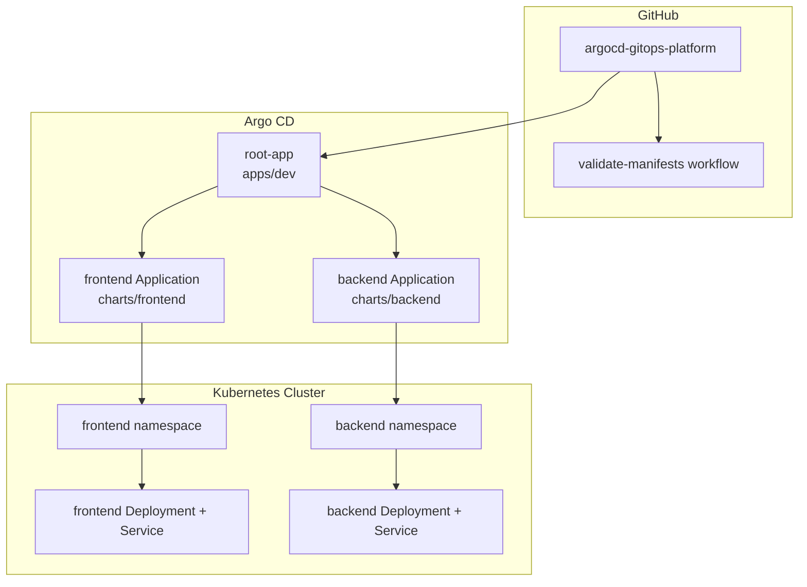

# GitOps Architecture

This platform uses Argo CD as the reconciliation engine between Git and Kubernetes. Developers change manifests in Git, CI validates them, and Argo CD applies the desired state to the cluster.

## Reconciliation Flow

1. A change is pushed to GitHub.
2. GitHub Actions validates manifests.
3. Argo CD detects the new Git revision.
4. `root-app` reconciles child Application manifests from `apps/dev`.
5. `frontend` and `backend` reconcile their Helm charts.
6. Kubernetes runs the frontend and backend workloads in separate namespaces.

## Control Boundaries

| Boundary | Implementation |
| --- | --- |
| Source of truth | GitHub repository |
| Reconciliation | Argo CD Applications |
| Packaging | Helm charts |
| Runtime isolation | `frontend` and `backend` namespaces |
| Validation | GitHub Actions manifest workflow |
